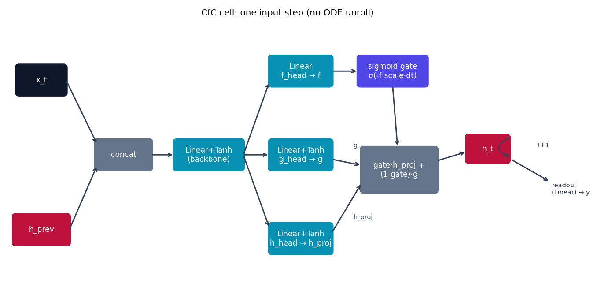

# CfC -- Closed-form Continuous-time Networks

CfC {cite}`hasani2022cfc` starts from the same ODE family as LTC (see
{doc}`ltc`) and asks: instead of unrolling a solver every step, can we write
down an approximate *closed-form solution* directly? The answer is yes, and
it's ~100x faster at both train and inference time for a small accuracy
cost. `models/cfc/model.py` implements exactly that closed form.

## The equation

The closed-form state update (paper Eq. 8-10 in {cite}`hasani2022cfc`) is:

$$
h(t) = \sigma\!\bigl(-f(x)\,t\bigr)\, g(x) \;+\; \Bigl(1 - \sigma\!\bigl(-f(x)\,t\bigr)\Bigr)\, h(x)
$$

where $f$, $g$, $h$ (confusingly reusing the letter $h$ for a *projection
head*, not the hidden state -- the code below calls it `h_proj` to avoid the
clash) are small feed-forward heads over a shared backbone, $\sigma$ is the
logistic sigmoid, and $t$ is the elapsed time since the last input. Compare
this to LTC's effective time constant
$\tau_{\text{eff}} = 1/(1/\tau + f)$: $\sigma(-f(x)t)$ plays the same
gating role -- large $f(x)$ collapses the gate to 0 quickly (fast forgetting
of the old state, same as a short $\tau_{\text{eff}}$), small $f(x)$ keeps
the gate near 1 (slow forgetting) -- but it's read directly off a formula
instead of being integrated.

## How it's built

`CfCCell.forward` in
[`models/cfc/model.py`](https://github.com/agpoks/liquid-nn-playground/blob/main/models/cfc/model.py)
maps onto the equation term for term:

```python
z = self.backbone(torch.cat([x_t, h_prev], dim=-1))   # shared features of (input, state)
f = self.f_head(z)                                      # f(x) -- the rate
g = torch.tanh(self.g_head(z))                          # g(x) -- new-state candidate
h_proj = torch.tanh(self.h_head(z))                     # h(x) -- retained-state candidate

gate = torch.sigmoid(-f * (self.time_scale.abs() + 1e-3) * dt)
h_new = gate * h_proj + (1 - gate) * g
```

`self.time_scale` is a learnable per-unit rescaling of $t$, so different
hidden units can learn to react on different timescales even though they
all see the same wall-clock `dt` -- the same multi-timescale idea LTC gets
from per-unit $\tau_i$, but folded into the gate instead of a separate
parameter that needs integrating. Because this is one direct formula (no
loop over sub-steps like {doc}`ltc`), `CfCModel.forward` calls the cell
exactly once per input step. See {doc}`../model_comparison` for the
side-by-side gate-shape plot.

Every `Linear`/`Linear+Tanh` box below is the affine map from
{doc}`../getting_started` (with an activation folded on where noted) -- the
part specific to CfC is the mix on the right, computed once, with no ODE
unroll at all:



```{eval-rst}
.. plot::

    from liquid_playground.utils.diagrams import new_ax, box, arrow, INPUT, LINEAR, NONLIN, STATE, OTHER

    fig, ax = new_ax(figsize=(10.5, 5.2), xlim=(0, 17), ylim=(0, 9))

    box(ax, 1.0, 7.0, 1.5, 1.0, "x_t", INPUT)
    box(ax, 1.0, 2.0, 1.7, 1.0, "h_prev", STATE)
    box(ax, 3.5, 4.5, 1.7, 1.0, "concat", OTHER)
    box(ax, 6.1, 4.5, 2.1, 1.0, "Linear+Tanh\n(backbone)", LINEAR)
    box(ax, 8.9, 7.3, 1.9, 1.0, "Linear\nf_head → f", LINEAR)
    box(ax, 8.9, 4.5, 1.9, 1.0, "Linear+Tanh\ng_head → g", LINEAR)
    box(ax, 8.9, 1.7, 1.9, 1.0, "Linear+Tanh\nh_head → h_proj", LINEAR)
    box(ax, 11.7, 7.3, 2.1, 1.0, "sigmoid gate\nσ(-f·scale·dt)", NONLIN)
    box(ax, 11.9, 4.0, 2.3, 1.5, "gate·h_proj +\n(1-gate)·g", OTHER)
    box(ax, 14.6, 4.7, 1.3, 0.9, "h_t", STATE)

    arrow(ax, (1.75, 7.0), (2.7, 4.85))
    arrow(ax, (1.85, 2.0), (2.7, 4.15))
    arrow(ax, (4.35, 4.5), (5.05, 4.5))
    arrow(ax, (7.15, 4.5), (7.95, 6.95))
    arrow(ax, (7.15, 4.5), (7.95, 4.5))
    arrow(ax, (7.15, 4.5), (7.95, 2.05))
    arrow(ax, (9.85, 7.3), (10.65, 7.3))
    arrow(ax, (11.7, 6.8), (11.85, 4.75))
    arrow(ax, (9.85, 1.9), (10.75, 3.55))
    ax.text(10.5, 2.35, "h_proj", fontsize=8, color="#334155")
    arrow(ax, (9.85, 4.35), (10.75, 4.15))
    ax.text(10.5, 4.75, "g", fontsize=8, color="#334155")
    arrow(ax, (13.05, 4.3), (13.95, 4.6))
    arrow(ax, (15.3, 5.1), (15.3, 4.4), curve=1.1, dashed=True)
    ax.text(16.3, 4.75, "t+1", fontsize=8, ha="center", color="#334155")
    arrow(ax, (15.3, 4.35), (16.5, 3.6))
    ax.text(16.55, 3.35, "readout\n(Linear) → y", fontsize=8, va="center", color="#334155")

    ax.set_title("CfC cell: one input step (no ODE unroll)", fontsize=11)
```

## Try it

```bash
python models/cfc/example.py --device auto           # PyTorch, trains on UCI Person Activity
python models/cfc/example_jax.py --device auto        # identical model in JAX/Flax
```

or open [`models/cfc/example.ipynb`](https://github.com/agpoks/liquid-nn-playground/blob/main/models/cfc/example.ipynb).
Full runnable code: [`models/cfc/model.py`](https://github.com/agpoks/liquid-nn-playground/blob/main/models/cfc/model.py) ·
[`models/cfc/model_jax.py`](https://github.com/agpoks/liquid-nn-playground/blob/main/models/cfc/model_jax.py) ·
[`models/cfc/README.md`](https://github.com/agpoks/liquid-nn-playground/blob/main/models/cfc/README.md).

## References

```{eval-rst}
.. bibliography::
   :filter: docname in docnames
```
