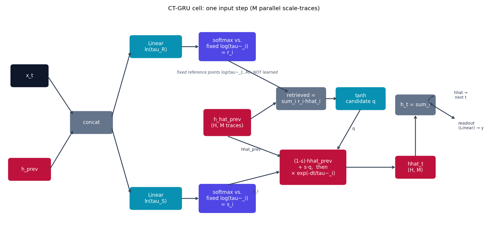

# CT-GRU -- Continuous-Time Gated Recurrent Unit

CT-GRU {cite}`mozer2017ctgru` completes the family the other baselines
sketch out one piece at a time: {doc}`rnn` (no time axis at all) ->
{doc}`ctrnn` (one fixed, learnable time constant) -> **CT-GRU (a *bank* of
fixed time constants, gated)** -> {doc}`node`/{doc}`liquid_lstm` ->
{doc}`ltc`/{doc}`cfc` (input-dependent time constants). See
{doc}`../model_comparison` for the full ladder.

## The equation

Instead of one time constant, CT-GRU keeps `num_scales` **pre-specified,
log-spaced** reference time constants
$\tilde\tau_1 < \tilde\tau_2 < \dots < \tilde\tau_M$ (hyperparameters, never
learned), and per hidden unit maintains $M$ parallel memory traces
$\hat h_i$, one per scale. At every step $k$ with elapsed time $\Delta t_k$:

$$
\ln\tilde\tau^R_k = W_R[x_k, h_{k-1}] + b_R, \qquad
r_{k,i} = \operatorname{softmax}_i\!\Bigl(-(\ln\tilde\tau^R_k - \ln\tilde\tau_i)^2\Bigr)
$$

$$
\ln\tilde\tau^S_k = W_S[x_k, h_{k-1}] + b_S, \qquad
s_{k,i} = \operatorname{softmax}_i\!\Bigl(-(\ln\tilde\tau^S_k - \ln\tilde\tau_i)^2\Bigr)
$$

$$
q_k = \tanh\Bigl(W_q\bigl[x_k,\, \textstyle\sum_i r_{k,i}\,\hat h_{k-1,i}\bigr] + b_q\Bigr)
$$

$$
\hat h_{k,i} = \Bigl[(1-s_{k,i})\,\hat h_{k-1,i} + s_{k,i}\,q_k\Bigr]\, e^{-\Delta t_k / \tilde\tau_i}, \qquad
h_k = \sum_i \hat h_{k,i}
$$

$r_{k,i}$/$s_{k,i}$ are Gaussian-shaped softmax kernels: each hidden unit
produces one *continuous* log-timescale estimate (`ln(tau_R)`, `ln(tau_S)`),
and the softmax over the squared distance to the $M$ *fixed* reference
points turns that into a soft "which bin" distribution -- the network can
smoothly slide which discrete scale it's using without the reference points
themselves ever moving. Compare this to {doc}`ctrnn`'s single, per-unit
learnable $\tau$: CT-GRU trades one learnable scalar for a richer, gated
choice among many fixed ones.

## How it's built

`CTGRUCell.forward` in
[`models/ctgru/model.py`](https://github.com/agpoks/liquid-nn-playground/blob/main/models/ctgru/model.py)
maps onto the equations directly. Notably, there is **no `ode_unfolds`
loop** anywhere -- `exp(-dt / tau_tilde_i)` is the *exact* solution of
$\dot{\hat h}_i = -\hat h_i/\tilde\tau_i$, so decaying every trace by the
real elapsed time is one closed-form multiply, not an approximated/unrolled
integration like {doc}`ltc` or {doc}`ctrnn` need:

```python
ln_tau_r = self.retrieval_gate(z).unsqueeze(-1)      # (B, H, 1)
ln_tau_s = self.storage_gate(z).unsqueeze(-1)        # (B, H, 1)
log_tau_tilde = self.log_tau_tilde.view(1, 1, -1)    # (1, 1, M) -- fixed buffer

r = torch.softmax(-((ln_tau_r - log_tau_tilde) ** 2), dim=-1)   # (B, H, M)
s = torch.softmax(-((ln_tau_s - log_tau_tilde) ** 2), dim=-1)   # (B, H, M)

retrieved = (r * hhat_prev).sum(dim=-1)                          # (B, H)
q = torch.tanh(self.candidate(torch.cat([x_t, retrieved], dim=-1)))

decay = torch.exp(-dt / self.tau_tilde).view(1, 1, -1)           # exact closed form
hhat = ((1.0 - s) * hhat_prev + s * q.unsqueeze(-1)) * decay     # (B, H, M)
h = hhat.sum(dim=-1)
```



```{eval-rst}
.. plot::

    from liquid_playground.utils.diagrams import new_ax, box, arrow, INPUT, LINEAR, NONLIN, STATE, OTHER

    fig, ax = new_ax(figsize=(13.0, 6.0), xlim=(0, 20), ylim=(0, 10))

    box(ax, 1.0, 7.0, 1.5, 1.0, "x_t", INPUT)
    box(ax, 1.0, 2.5, 1.7, 1.0, "h_prev", STATE)
    box(ax, 3.6, 4.75, 1.7, 1.0, "concat", OTHER)

    box(ax, 6.3, 8.4, 2.1, 1.0, "Linear\nln(tau_R)", LINEAR)
    box(ax, 6.3, 1.1, 2.1, 1.0, "Linear\nln(tau_S)", LINEAR)

    box(ax, 9.3, 8.4, 2.3, 1.3, "softmax vs.\nfixed log(tau~_i)\n= r_i", NONLIN)
    box(ax, 9.3, 1.1, 2.3, 1.3, "softmax vs.\nfixed log(tau~_i)\n= s_i", NONLIN)

    box(ax, 9.3, 4.75, 1.9, 1.2, "h_hat_prev\n(H, M traces)", STATE)
    box(ax, 12.4, 5.9, 2.0, 1.0, "retrieved =\nsum_i r_i·hhat_i", OTHER)
    box(ax, 14.9, 5.9, 2.0, 1.0, "tanh\ncandidate q", LINEAR)

    box(ax, 12.9, 2.6, 2.7, 1.6, "(1-s)·hhat_prev\n+ s·q,  then\n× exp(-dt/tau~_i)", STATE)
    box(ax, 17.2, 2.6, 1.6, 1.0, "hhat_t\n(H, M)", STATE)
    box(ax, 17.2, 5.6, 1.6, 0.9, "h_t = sum_i", OTHER)

    arrow(ax, (1.75, 7.0), (2.85, 5.1))
    arrow(ax, (1.85, 2.5), (2.85, 4.4))
    arrow(ax, (4.45, 5.0), (5.25, 8.2))
    arrow(ax, (4.45, 4.5), (5.25, 1.3))
    arrow(ax, (7.35, 8.4), (8.15, 8.4))
    arrow(ax, (7.35, 1.1), (8.15, 1.1))
    arrow(ax, (9.3, 7.75), (11.9, 6.2))
    arrow(ax, (10.25, 4.9), (11.4, 5.75))
    arrow(ax, (13.4, 5.9), (13.95, 5.9))
    arrow(ax, (14.9, 5.4), (13.9, 3.4))
    ax.text(14.6, 4.4, "q", fontsize=8, ha="center", color="#334155")
    arrow(ax, (9.3, 4.1), (11.6, 3.1))
    ax.text(10.3, 3.4, "hhat_prev", fontsize=7.5, ha="center", color="#334155")
    arrow(ax, (9.3, 1.75), (11.55, 2.4))
    ax.text(10.5, 1.4, "s_i", fontsize=8, ha="center", color="#334155")
    arrow(ax, (14.25, 2.6), (16.4, 2.6))
    arrow(ax, (17.2, 3.1), (17.2, 5.15))

    arrow(ax, (18.0, 6.05), (18.0, 5.55), curve=1.1, dashed=True)
    ax.text(19.1, 5.9, "hhat →\nnext t", fontsize=7.5, ha="center", color="#334155")
    arrow(ax, (17.9, 5.6), (18.9, 4.9))
    ax.text(19.0, 4.6, "readout\n(Linear) → y", fontsize=8, va="center", color="#334155")

    ax.text(9.3, 7.1, "fixed reference points log(tau~_1..M): NOT learned",
            fontsize=7.5, ha="center", color="#475569", style="italic")

    ax.set_title("CT-GRU cell: one input step (M parallel scale-traces)", fontsize=11)
```

`CTGRUModel` carries both `h` (used only to compute the next step's gates)
and `hhat` (the actual $(B, H, M)$ multiscale state) across the sequence,
similar to how {doc}`liquid_lstm` carries both `h` and `c`.

## Try it

```bash
python models/ctgru/example.py --device auto     # same UCI Ozone task as models/ltc
```

or open [`models/ctgru/example.ipynb`](https://github.com/agpoks/liquid-nn-playground/blob/main/models/ctgru/example.ipynb).
Full runnable code: [`models/ctgru/model.py`](https://github.com/agpoks/liquid-nn-playground/blob/main/models/ctgru/model.py) ·
[`models/ctgru/README.md`](https://github.com/agpoks/liquid-nn-playground/blob/main/models/ctgru/README.md).

## References

```{eval-rst}
.. bibliography::
   :filter: docname in docnames
```
