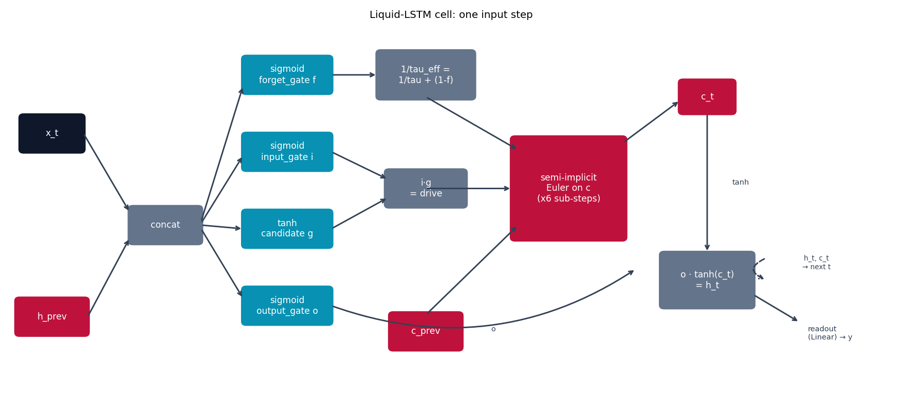

# Liquid-LSTM -- a hybrid built for this repo

Unlike every other model in this repo, **there is no single "Liquid-LSTM"
paper**. This one is a hybrid built specifically for this playground,
combining LSTM's gating {cite}`hochreiter1997lstm` with {doc}`ltc`'s
continuous-time, input-gated leak {cite}`hasani2021ltc` -- included after
checking the literature for a real "Liquid-LSTM"/"Liquid Transformer"
architecture and finding neither exists (see `papers/README.md`).

## The equation

Standard LSTM computes four gates and one discrete cell-state update:

$$
f_t = \sigma(W_f z_t),\quad i_t = \sigma(W_i z_t),\quad g_t = \tanh(W_g z_t),\quad o_t = \sigma(W_o z_t), \qquad z_t = [x_t, h_{t-1}]
$$

$$
c_t = f_t \odot c_{t-1} + i_t \odot g_t, \qquad h_t = o_t \odot \tanh(c_t)
$$

Liquid-LSTM keeps all four gates -- so it still has LSTM's separate
write/erase/read control, unlike LTC's single synapse -- but replaces the
discrete cell update with LTC's continuous-time ODE, using the forget gate
to build an input-dependent effective time constant the same way LTC's
synapse $f_i$ does:

$$
\frac{dc}{dt} = -\frac{c}{\tau_{\text{eff}}} + i_t \odot g_t, \qquad \frac{1}{\tau_{\text{eff}}} = \frac{1}{\tau} + (1 - f_t)
$$

$f_t$ near 1 ("remember") pushes $(1 - f_t)$ near 0, so $\tau_{\text{eff}}$
stays close to the free-running $\tau$ -- slow decay, long memory, same as
a standard forget gate near 1. $f_t$ near 0 ("forget") pushes
$\tau_{\text{eff}}$ down -- fast decay, the same qualitative behavior as a
standard forget gate near 0, but now realized as a genuinely continuous-time
leak (with its own `dt`/`ode_unfolds`) instead of one discrete multiply.

## How it's built

`LiquidLSTMCell.forward` in
[`models/liquid_lstm/model.py`](https://github.com/agpoks/liquid-nn-playground/blob/main/models/liquid_lstm/model.py)
computes the four gates exactly like a standard LSTM, then solves the cell
state with the same fused semi-implicit Euler scheme {doc}`ltc` and
{doc}`ctrnn` use:

```python
z = torch.cat([x_t, h_prev], dim=-1)
f = torch.sigmoid(self.forget_gate(z))
i = torch.sigmoid(self.input_gate(z))
g = torch.tanh(self.candidate(z))
o = torch.sigmoid(self.output_gate(z))

tau = softplus(self.tau) + 1e-3
sub_dt = dt / self.ode_unfolds
drive = i * g  # frozen for the sub-steps, like LTC freezes f*A per input step

c = c_prev
for _ in range(self.ode_unfolds):
    numerator = c + sub_dt * drive
    denominator = 1.0 + sub_dt * (1.0 / tau + (1.0 - f))
    c = numerator / denominator

h = o * torch.tanh(c)
```



```{eval-rst}
.. plot::

    from liquid_playground.utils.diagrams import new_ax, box, arrow, INPUT, LINEAR, NONLIN, STATE, OTHER

    fig, ax = new_ax(figsize=(13.5, 6.0), xlim=(0, 21), ylim=(0, 10))

    box(ax, 1.0, 7.0, 1.5, 1.0, "x_t", INPUT)
    box(ax, 1.0, 2.0, 1.7, 1.0, "h_prev", STATE)
    box(ax, 3.7, 4.5, 1.7, 1.0, "concat", OTHER)

    box(ax, 6.6, 8.6, 2.1, 1.0, "sigmoid\nforget_gate f", LINEAR)
    box(ax, 6.6, 6.5, 2.1, 1.0, "sigmoid\ninput_gate i", LINEAR)
    box(ax, 6.6, 4.4, 2.1, 1.0, "tanh\ncandidate g", LINEAR)
    box(ax, 6.6, 2.3, 2.1, 1.0, "sigmoid\noutput_gate o", LINEAR)

    box(ax, 9.9, 8.6, 2.3, 1.3, "1/tau_eff =\n1/tau + (1-f)", OTHER)
    box(ax, 9.9, 5.5, 1.9, 1.0, "i·g\n= drive", OTHER)
    box(ax, 9.9, 1.6, 1.7, 1.0, "c_prev", STATE)

    box(ax, 13.3, 5.5, 2.7, 2.8, "semi-implicit\nEuler on c\n(x6 sub-steps)", STATE)
    box(ax, 16.6, 8.0, 1.3, 0.9, "c_t", STATE)
    box(ax, 16.6, 3.0, 2.2, 1.5, "o · tanh(c_t)\n= h_t", OTHER)

    arrow(ax, (1.75, 7.0), (2.85, 4.85))
    arrow(ax, (1.85, 2.0), (2.85, 4.15))
    arrow(ax, (4.55, 4.6), (5.55, 8.3))
    arrow(ax, (4.55, 4.55), (5.55, 6.4))
    arrow(ax, (4.55, 4.5), (5.55, 4.4))
    arrow(ax, (4.55, 4.4), (5.55, 2.5))
    arrow(ax, (7.65, 8.6), (8.75, 8.6))
    arrow(ax, (7.65, 6.5), (9.0, 5.75))
    arrow(ax, (7.65, 4.4), (9.0, 5.25))
    arrow(ax, (9.9, 8.0), (12.1, 6.55))
    arrow(ax, (9.9, 5.5), (11.95, 5.5))
    arrow(ax, (9.9, 2.05), (12.1, 4.5))
    arrow(ax, (14.6, 6.75), (15.95, 7.9))
    arrow(ax, (16.6, 7.55), (16.6, 3.75))
    ax.text(17.4, 5.6, "tanh", fontsize=8, ha="center", color="#334155")
    arrow(ax, (7.65, 2.3), (14.9, 3.3), curve=0.25)
    ax.text(11.5, 1.6, "o", fontsize=8, ha="center", color="#334155")

    arrow(ax, (18.0, 3.6), (18.0, 3.0), curve=1.1, dashed=True)
    ax.text(19.2, 3.3, "h_t, c_t\n→ next t", fontsize=7.5, ha="center", color="#334155")
    arrow(ax, (17.7, 2.6), (18.8, 1.85))
    ax.text(19.0, 1.55, "readout\n(Linear) → y", fontsize=8, va="center", color="#334155")

    ax.set_title("Liquid-LSTM cell: one input step", fontsize=11)
```

`LiquidLSTMModel` then loops the cell over the sequence (carrying both `h`
and `c` this time, unlike the single-state models elsewhere in this repo)
and reads out the final hidden state, exactly like every other model here.

## Try it

```bash
python models/liquid_lstm/example.py --device auto     # same UCI Ozone task as models/ltc
```

or open [`models/liquid_lstm/example.ipynb`](https://github.com/agpoks/liquid-nn-playground/blob/main/models/liquid_lstm/example.ipynb).
Full runnable code: [`models/liquid_lstm/model.py`](https://github.com/agpoks/liquid-nn-playground/blob/main/models/liquid_lstm/model.py) ·
[`models/liquid_lstm/README.md`](https://github.com/agpoks/liquid-nn-playground/blob/main/models/liquid_lstm/README.md).

## References

```{eval-rst}
.. bibliography::
   :filter: docname in docnames
```
