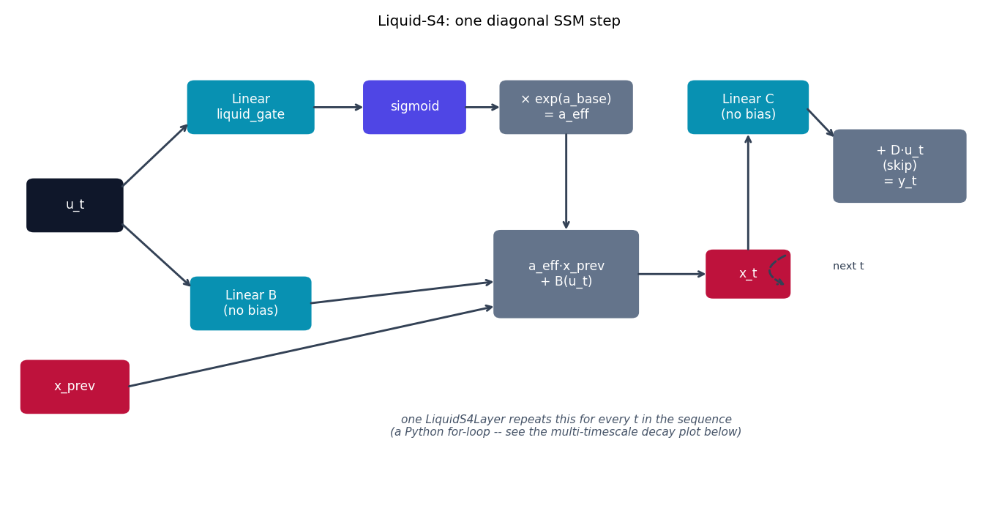
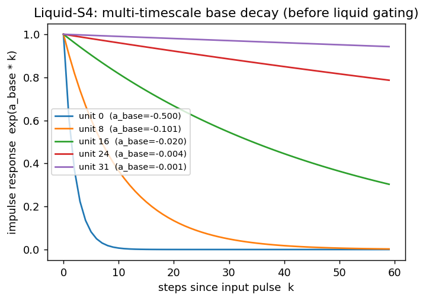

# Liquid-S4

Liquid-S4 {cite}`hasani2023liquids4` starts from a completely different
place than LTC/CfC: a **structured state-space model** (S4-style), which is
discrete-time and normally has a *fixed* linear transition. Liquid-S4's
contribution is making that transition input-dependent -- borrowing the
"liquid" idea, but grafting it onto a linear recurrence instead of an ODE.

## The equation

A plain diagonal S4/S4D-style layer runs the linear recurrence

$$
x_k = A\,x_{k-1} + B\,u_k, \qquad y_k = C\,x_k
$$

with a **fixed** diagonal $A$. `models/liquid_s4/model.py` implements the
liquid version of this: $A$ is replaced by a per-step effective decay that's
gated by the current input,

$$
a_{\text{eff}}(u_k) = e^{a_{\text{base}}} \odot \sigma\bigl(W_{\text{liquid}}\,u_k + b_{\text{liquid}}\bigr), \qquad
x_k = a_{\text{eff}}(u_k) \odot x_{k-1} + B\,u_k
$$

$a_{\text{base}} = -e^{\text{log\_decay}}$ is a per-unit, HiPPO-inspired base
decay rate spread on a log scale (so different state units specialize to
different timescales by default, before any input-dependent modulation), and
$\sigma(\cdot) \in (0, 1)$ is the "liquid" correction: a strong input can
temporarily slow a unit's decay down towards its base rate, or (since
$\sigma < 1$ always shrinks $a_{\text{eff}}$ below $e^{a_{\text{base}}}$)
sharpen the forgetting of state units that aren't currently relevant.

## How it's built

`LiquidS4Layer.forward` in
[`models/liquid_s4/model.py`](https://github.com/agpoks/liquid-nn-playground/blob/main/models/liquid_s4/model.py):

```python
log_decay = torch.linspace(math.log(0.5), math.log(0.001), state_size)  # HiPPO-ish spread
a_base = -torch.exp(self.log_decay)                                      # always < 0 => stable

for t in range(seq_len):
    liquid_mod = torch.sigmoid(self.liquid_gate(u_t))    # input-dependent correction, in (0,1)
    a_eff = torch.exp(a_base) * liquid_mod                # the actual per-step decay used
    x = a_eff * x + self.B(u_t)
    ys.append(self.C(x) + self.D * u_t)
```

Unlike {doc}`ltc`/{doc}`cfc`, there's no `dt`/elapsed-time argument anywhere
here -- one call is one discrete token, full stop (see
{doc}`../model_comparison`). This is also a **sequential Python loop**, not
the paper's FFT convolution: the official Liquid-S4 trains by rewriting the
whole-sequence linear recurrence as one big convolution, computed in the
frequency domain, which is what lets a linear SSM train as fast as it does.
That rewrite depends on $A$ being *fixed* per layer, though -- Liquid-S4's
whole point is that $A$ *isn't* fixed here, so the official implementation
uses a more involved (still fast) scheme. This reimplementation keeps the
easy-to-read sequential loop and trades the FFT-convolution speed for
clarity; see {doc}`lrcssm` for a model in this repo that *does* ship a fast
parallel path.



```{eval-rst}
.. plot::

    from liquid_playground.utils.diagrams import new_ax, box, arrow, INPUT, LINEAR, NONLIN, STATE, OTHER

    fig, ax = new_ax(figsize=(10.5, 5.4), xlim=(0, 16), ylim=(0, 9.5))

    box(ax, 1.0, 6.0, 1.5, 1.0, "u_t", INPUT)
    box(ax, 1.0, 2.3, 1.7, 1.0, "x_prev", STATE)
    box(ax, 3.9, 8.0, 2.0, 1.0, "Linear\nliquid_gate", LINEAR)
    box(ax, 6.6, 8.0, 1.6, 1.0, "sigmoid", NONLIN)
    box(ax, 9.1, 8.0, 2.1, 1.0, "× exp(a_base)\n= a_eff", OTHER)
    box(ax, 3.9, 4.0, 1.9, 1.0, "Linear B\n(no bias)", LINEAR)
    box(ax, 9.1, 4.6, 2.3, 1.7, "a_eff·x_prev\n+ B(u_t)", OTHER)
    box(ax, 12.1, 4.6, 1.3, 0.9, "x_t", STATE)
    box(ax, 12.1, 8.0, 1.9, 1.0, "Linear C\n(no bias)", LINEAR)
    box(ax, 14.6, 6.8, 2.1, 1.4, "+ D·u_t\n(skip)\n= y_t", OTHER)

    arrow(ax, (1.75, 6.35), (2.9, 7.7))
    arrow(ax, (1.75, 5.65), (2.95, 4.3))
    arrow(ax, (4.9, 8.0), (5.8, 8.0))
    arrow(ax, (7.4, 8.0), (8.05, 8.0))
    arrow(ax, (9.1, 7.5), (9.1, 5.45))
    arrow(ax, (4.85, 4.0), (7.95, 4.45))
    arrow(ax, (1.85, 2.3), (7.95, 3.95))
    arrow(ax, (10.25, 4.6), (11.45, 4.6))
    arrow(ax, (12.1, 5.05), (12.1, 7.5))
    arrow(ax, (13.05, 8.0), (13.55, 7.35))
    arrow(ax, (12.75, 5.0), (12.75, 4.35), curve=1.1, dashed=True)
    ax.text(13.75, 4.7, "next t", fontsize=8, ha="center", color="#334155")

    ax.text(9.1, 1.3,
            "one LiquidS4Layer repeats this for every t in the sequence\n"
            "(a Python for-loop -- see the multi-timescale decay plot below)",
            fontsize=8.5, ha="center", color="#475569", style="italic")

    ax.set_title("Liquid-S4: one diagonal SSM step", fontsize=11)
```

## Multi-timescale memory, visualized

The base decay rates `a_base` are spread on a log scale specifically so
different state units remember over different horizons. The plot below
shows the (input-independent) impulse response $e^{a_{\text{base}} \cdot k}$
for a few of those units -- i.e., how much a unit that received one pulse at
$k=0$ still "remembers" $k$ steps later, absent any liquid modulation:



```{eval-rst}
.. plot::

    import numpy as np
    import matplotlib.pyplot as plt

    state_size = 32
    log_decay = np.linspace(np.log(0.5), np.log(0.001), state_size)
    a_base = -np.exp(log_decay)

    k = np.arange(0, 60)
    fig, ax = plt.subplots(figsize=(6, 4))
    for idx in [0, 8, 16, 24, 31]:
        response = np.exp(a_base[idx] * k)
        ax.plot(k, response, label=f"unit {idx}  (a_base={a_base[idx]:.3f})")

    ax.set_xlabel("steps since input pulse  k")
    ax.set_ylabel("impulse response  exp(a_base * k)")
    ax.set_title("Liquid-S4: multi-timescale base decay (before liquid gating)")
    ax.legend(fontsize=8)
```

Units near index 0 (small $|a_{\text{base}}|$) decay almost instantly --
short-term memory; units near index 31 decay over dozens of steps --
long-term memory. The liquid gate then modulates *around* this fixed
spread on a per-input basis.

## Try it

```bash
python models/liquid_s4/example.py --device auto     # ETTh1 forecasting
```

or open [`models/liquid_s4/example.ipynb`](https://github.com/agpoks/liquid-nn-playground/blob/main/models/liquid_s4/example.ipynb).
Full runnable code: [`models/liquid_s4/model.py`](https://github.com/agpoks/liquid-nn-playground/blob/main/models/liquid_s4/model.py) ·
[`models/liquid_s4/README.md`](https://github.com/agpoks/liquid-nn-playground/blob/main/models/liquid_s4/README.md).

## References

```{eval-rst}
.. bibliography::
   :filter: docname in docnames
```
