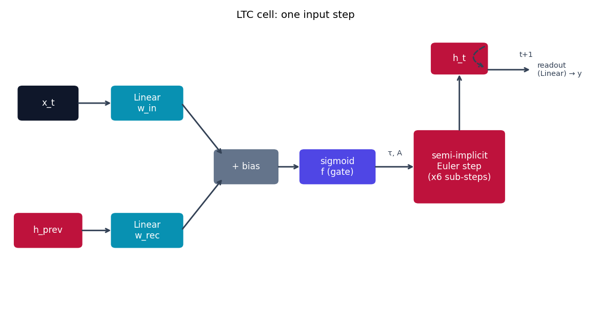
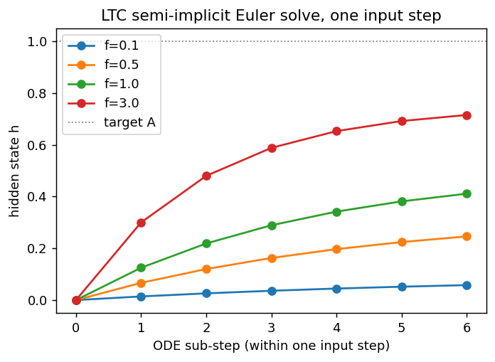

# LTC -- Liquid Time-Constant Networks

Liquid Time-Constant networks {cite}`hasani2021ltc` are the model the rest of
this repo is named after. Every hidden unit is a leaky integrator with one
twist: its time constant is not a fixed hyperparameter, it's a function of
the current input. `models/ltc/model.py` implements this directly; this page
walks through the equation, how the code realizes it, and what the resulting
dynamics look like.

## The equation

Each hidden unit $x_i$ obeys the ODE (paper Eq. 5-6 in {cite}`hasani2021ltc`):

$$
\frac{dx_i}{dt} = -\frac{x_i}{\tau_i} + f_i(x, I;\, \theta)\,\bigl(A_i - x_i\bigr)
$$

where $f_i$ is a sigmoidal synapse driven by the recurrent state $x$ and
input $I$, $\tau_i$ is a learnable time constant, and $A_i$ is a learnable
reversal potential. Rearranging the two $x_i$ terms gives the "liquid"
reading of this equation directly:

$$
\frac{dx_i}{dt} = -\underbrace{\left(\frac{1}{\tau_i} + f_i(x, I)\right)}_{1/\tau_{\text{eff}}}x_i \;+\; f_i(x, I)\,A_i
$$

The bracketed term is an **input-dependent effective time constant**
$\tau_{\text{eff}} = 1 / (1/\tau_i + f_i)$: a strong synaptic drive $f_i$
shortens it (the neuron reacts fast to what it's looking at right now); a
weak drive leaves it close to the free-running $\tau_i$ (the neuron
integrates slowly and retains past information). This is literally what
"liquid" refers to in the name.

## How it's built

`LTCCell.forward` in
[`models/ltc/model.py`](https://github.com/agpoks/liquid-nn-playground/blob/main/models/ltc/model.py)
doesn't call a general-purpose ODE solver -- it unrolls a small, fixed
number of **semi-implicit (backward) Euler** sub-steps, freezing $f$ at its
value from the start of the sub-step and solving the resulting *linear* ODE
in $x$ implicitly (unconditionally stable, so no step-size tuning):

```python
tau = softplus(self.tau) + 1e-3
sub_dt = dt / self.ode_unfolds          # default ode_unfolds = 6

h = h_prev
for _ in range(self.ode_unfolds):
    pre = h @ self.w_rec.T + x_t @ self.w_in.T + self.bias
    f = sigmoid(pre)                     # f_i(x, I) -- frozen for this sub-step
    numerator = h + sub_dt * f * self.A
    denominator = 1.0 + sub_dt * (1.0 / tau + f)
    h = numerator / denominator          # implicit solve of the linear ODE in h
```

That `numerator / denominator` line *is* the backward-Euler update for
$\dot x = -(1/\tau + f)x + fA$ solved for $x_{t+\Delta t}$ given $x_t$.
Repeating it `ode_unfolds` times per input step is what makes this a
genuinely continuous-time model rather than a fixed-step discrete one: you
can increase `ode_unfolds` for more numerical accuracy without changing the
learned parameters. `softplus(self.tau) + 1e-3` keeps $\tau_i$ strictly
positive (a free/negative time constant would make the neuron divergent).
`LTCModel` then just loops `LTCCell` over the sequence and reads out the
final hidden state -- see {doc}`../model_comparison` for how this compares to
the other four models' notion of time.

Every `Linear` box below is exactly the affine map described in
{doc}`../getting_started` -- the parts actually specific to LTC are the
sigmoid gate and the semi-implicit Euler solve on the right:



```{eval-rst}
.. plot::

    from liquid_playground.utils.diagrams import new_ax, box, arrow, INPUT, LINEAR, NONLIN, STATE, OTHER

    fig, ax = new_ax(figsize=(9.0, 4.8), xlim=(0, 15), ylim=(0, 9))

    box(ax, 1.0, 6.5, 1.5, 1.0, "x_t", INPUT)
    box(ax, 1.0, 2.5, 1.7, 1.0, "h_prev", STATE)
    box(ax, 3.6, 6.5, 1.8, 1.0, "Linear\nw_in", LINEAR)
    box(ax, 3.6, 2.5, 1.8, 1.0, "Linear\nw_rec", LINEAR)
    box(ax, 6.2, 4.5, 1.6, 1.0, "+ bias", OTHER)
    box(ax, 8.6, 4.5, 1.9, 1.0, "sigmoid\nf (gate)", NONLIN)
    box(ax, 11.8, 4.5, 2.3, 2.2, "semi-implicit\nEuler step\n(x6 sub-steps)", STATE)
    box(ax, 11.8, 7.9, 1.4, 0.9, "h_t", STATE)

    arrow(ax, (1.75, 6.5), (2.7, 6.5))
    arrow(ax, (1.85, 2.5), (2.7, 2.5))
    arrow(ax, (4.5, 6.5), (5.6, 4.85))
    arrow(ax, (4.5, 2.5), (5.6, 4.15))
    arrow(ax, (7.0, 4.5), (7.65, 4.5))
    arrow(ax, (9.55, 4.5), (10.65, 4.5))
    ax.text(10.1, 4.85, "τ, A", fontsize=8, ha="center", color="#334155")
    arrow(ax, (11.8, 5.6), (11.8, 7.45))
    arrow(ax, (12.5, 8.3), (12.5, 7.6), curve=1.1, dashed=True)
    ax.text(13.55, 7.95, "t+1", fontsize=8, ha="center", color="#334155")
    arrow(ax, (12.5, 7.55), (13.7, 7.55))
    ax.text(13.85, 7.55, "readout\n(Linear) → y", fontsize=8, va="center", color="#334155")

    ax.set_title("LTC cell: one input step", fontsize=11)
```

## The solver in action

The plot below runs the exact update above (same equations, same
`ode_unfolds=6` default) for a single unit with $\tau=1$, $A=1$, starting
from $x_0=0$, under a few different constant synaptic drives $f$. Larger $f$
pulls the neuron to its target $A$ within the 6 sub-steps; small $f$ barely
moves it -- exactly the fast/slow effective-time-constant behavior from the
equation above, but seen as an actual trajectory instead of just the
steady-state formula.



```{eval-rst}
.. plot::

    import numpy as np
    import matplotlib.pyplot as plt

    tau, A, ode_unfolds, dt = 1.0, 1.0, 6, 1.0
    sub_dt = dt / ode_unfolds

    fig, ax = plt.subplots(figsize=(6, 4))
    for f in [0.1, 0.5, 1.0, 3.0]:
        h = 0.0
        trace = [h]
        for _ in range(ode_unfolds):
            numerator = h + sub_dt * f * A
            denominator = 1.0 + sub_dt * (1.0 / tau + f)
            h = numerator / denominator
            trace.append(h)
        ax.plot(range(ode_unfolds + 1), trace, marker="o", label=f"f={f}")

    ax.axhline(A, color="gray", linestyle=":", linewidth=1, label="target A")
    ax.set_xlabel("ODE sub-step (within one input step)")
    ax.set_ylabel("hidden state h")
    ax.set_title("LTC semi-implicit Euler solve, one input step")
    ax.legend()
```

## Try it

```bash
python models/ltc/example.py --device auto     # trains on UCI Ozone
```

or open [`models/ltc/example.ipynb`](https://github.com/agpoks/liquid-nn-playground/blob/main/models/ltc/example.ipynb).
Full runnable code: [`models/ltc/model.py`](https://github.com/agpoks/liquid-nn-playground/blob/main/models/ltc/model.py) ·
[`models/ltc/README.md`](https://github.com/agpoks/liquid-nn-playground/blob/main/models/ltc/README.md).

## References

```{eval-rst}
.. bibliography::
   :filter: docname in docnames
```
