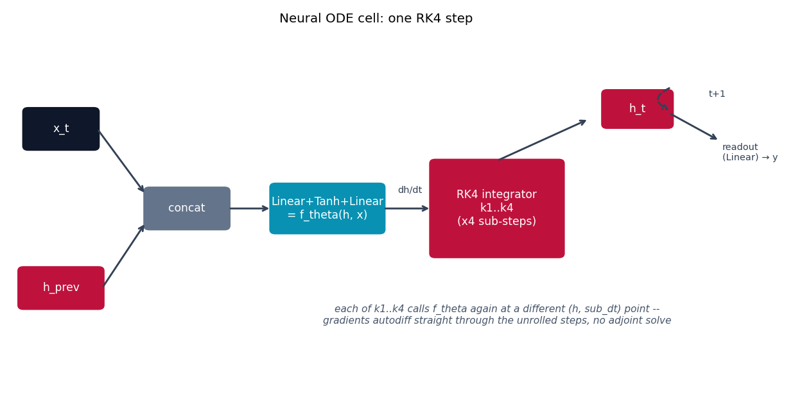

# Neural ODE -- the fully general case

Neural ODE {cite}`chen2018neuralode` is the last rung of the baseline ladder
before {doc}`ltc`: a genuinely continuous-time hidden state, exactly like
LTC, but with a completely unconstrained learned right-hand side. LTC *is* a
Neural ODE -- it's this equation with one specific, provably-bounded
right-hand side substituted in; this module is the general case LTC
specializes.

## The equation

$$
\frac{dh}{dt} = f_\theta(h, x)
$$

with $f_\theta$ an arbitrary small MLP. No leak term, no fixed structure, no
built-in stability guarantee -- compare to {doc}`ltc`'s
$dx/dt = -x/\tau + f(x,I)(A-x)$, which is this same equation shape with
$f_\theta$ replaced by a specific sigmoidal-gate-times-leak form that the
paper proves keeps $x$ bounded. Here, $f_\theta$ can compute anything a
2-layer MLP can represent, at the cost of that guarantee.

## How it's built

Because a fully generic $f_\theta$ has no linear structure to exploit for an
implicit solve the way {doc}`ltc`'s or {doc}`ctrnn`'s does, `NeuralODECell`
in
[`models/node/model.py`](https://github.com/agpoks/liquid-nn-playground/blob/main/models/node/model.py)
integrates with a hand-written classic 4th-order Runge-Kutta (RK4) step
instead of semi-implicit Euler:

```python
def _dh(self, h, x_t):
    return self.f(torch.cat([h, x_t], dim=-1))   # f_theta(h, x)

def forward(self, x_t, h_prev, dt: float = 1.0):
    sub_dt = dt / self.ode_unfolds
    h = h_prev
    for _ in range(self.ode_unfolds):
        k1 = self._dh(h, x_t)
        k2 = self._dh(h + 0.5 * sub_dt * k1, x_t)
        k3 = self._dh(h + 0.5 * sub_dt * k2, x_t)
        k4 = self._dh(h + sub_dt * k3, x_t)
        h = h + (sub_dt / 6.0) * (k1 + 2 * k2 + 2 * k3 + k4)
    return h
```

Gradients here come from autodiffing directly through the unrolled RK4
steps, *not* the paper's memory-efficient adjoint method (which computes
gradients by solving a second, backward-in-time ODE instead of storing every
solver step). That's fine at the short sequence lengths used in this repo;
the adjoint trick is the paper's actual headline contribution and is what
makes Neural ODEs practical at much greater depths -- see the paper Sec. 2-3,
or [`torchdiffeq`](https://github.com/rtqichen/torchdiffeq) (the paper
authors' own package) for a production adjoint-method solver.



```{eval-rst}
.. plot::

    from liquid_playground.utils.diagrams import new_ax, box, arrow, INPUT, LINEAR, NONLIN, STATE, OTHER

    fig, ax = new_ax(figsize=(9.5, 4.8), xlim=(0, 15), ylim=(0, 9))

    box(ax, 1.0, 6.5, 1.5, 1.0, "x_t", INPUT)
    box(ax, 1.0, 2.5, 1.7, 1.0, "h_prev", STATE)
    box(ax, 3.6, 4.5, 1.7, 1.0, "concat", OTHER)
    box(ax, 6.5, 4.5, 2.3, 1.2, "Linear+Tanh+Linear\n= f_theta(h, x)", LINEAR)
    box(ax, 10.0, 4.5, 2.7, 2.4, "RK4 integrator\nk1..k4\n(x4 sub-steps)", STATE)
    box(ax, 12.9, 7.0, 1.4, 0.9, "h_t", STATE)

    arrow(ax, (1.75, 6.5), (2.75, 4.85))
    arrow(ax, (1.85, 2.5), (2.75, 4.15))
    arrow(ax, (4.45, 4.5), (5.35, 4.5))
    arrow(ax, (7.65, 4.5), (8.65, 4.5))
    ax.text(8.2, 4.9, "dh/dt", fontsize=8, ha="center", color="#334155")
    arrow(ax, (10.0, 5.7), (11.9, 6.75))
    arrow(ax, (13.6, 7.55), (13.6, 6.95), curve=1.1, dashed=True)
    ax.text(14.55, 7.3, "t+1", fontsize=8, ha="center", color="#334155")
    arrow(ax, (13.55, 6.9), (14.6, 6.2))
    ax.text(14.65, 5.9, "readout\n(Linear) → y", fontsize=8, va="center", color="#334155")

    ax.text(10.0, 1.6,
            "each of k1..k4 calls f_theta again at a different (h, sub_dt) point --\n"
            "gradients autodiff straight through the unrolled steps, no adjoint solve",
            fontsize=8.5, ha="center", color="#475569", style="italic")

    ax.set_title("Neural ODE cell: one RK4 step", fontsize=11)
```

## Try it

```bash
python models/node/example.py --device auto     # same UCI Ozone task as models/ltc
```

or open [`models/node/example.ipynb`](https://github.com/agpoks/liquid-nn-playground/blob/main/models/node/example.ipynb).
Full runnable code: [`models/node/model.py`](https://github.com/agpoks/liquid-nn-playground/blob/main/models/node/model.py) ·
[`models/node/README.md`](https://github.com/agpoks/liquid-nn-playground/blob/main/models/node/README.md).

## References

```{eval-rst}
.. bibliography::
   :filter: docname in docnames
```
